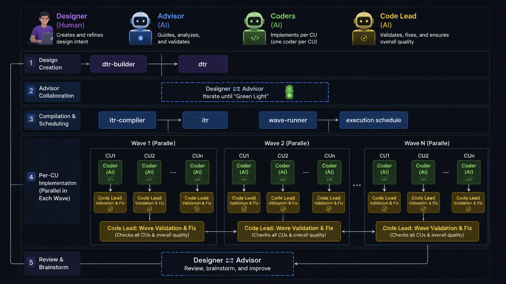
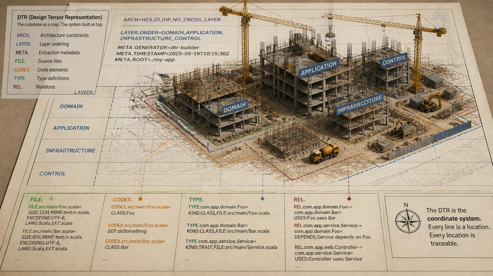
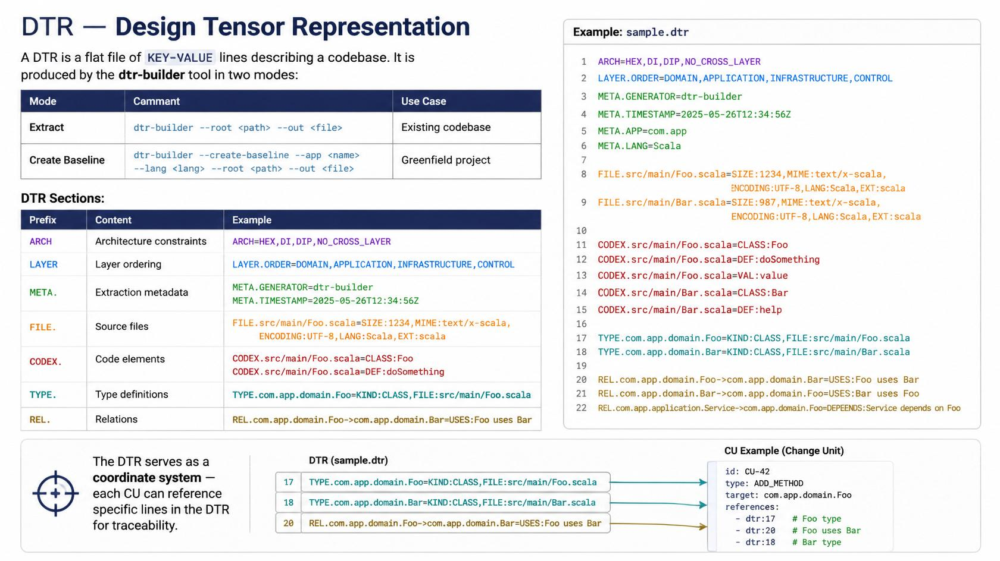
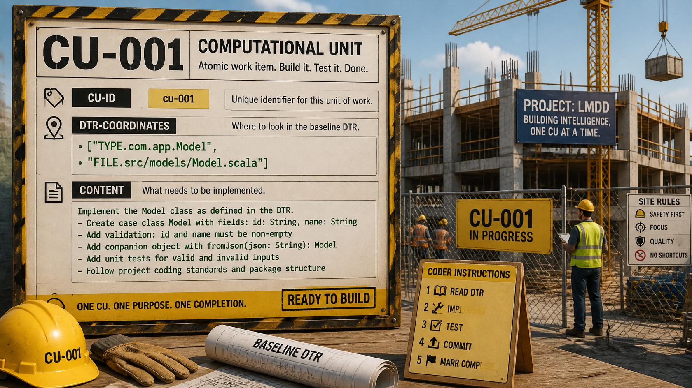
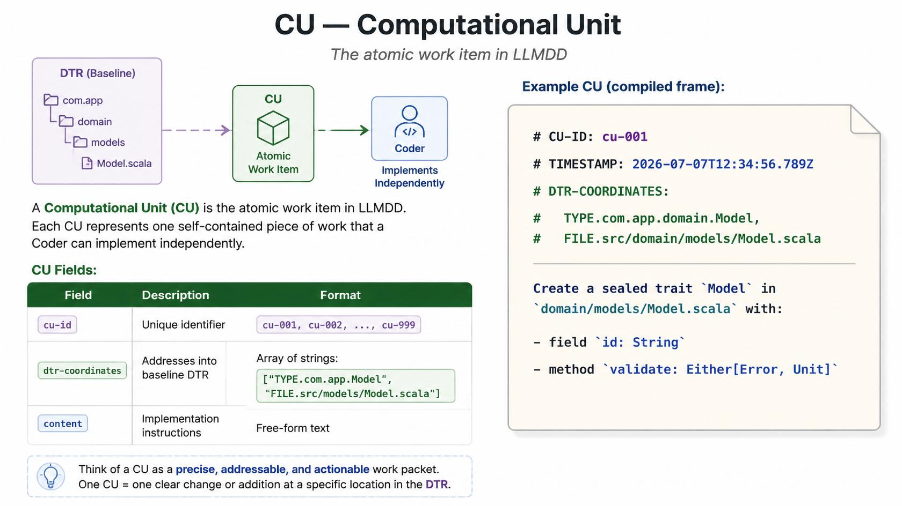
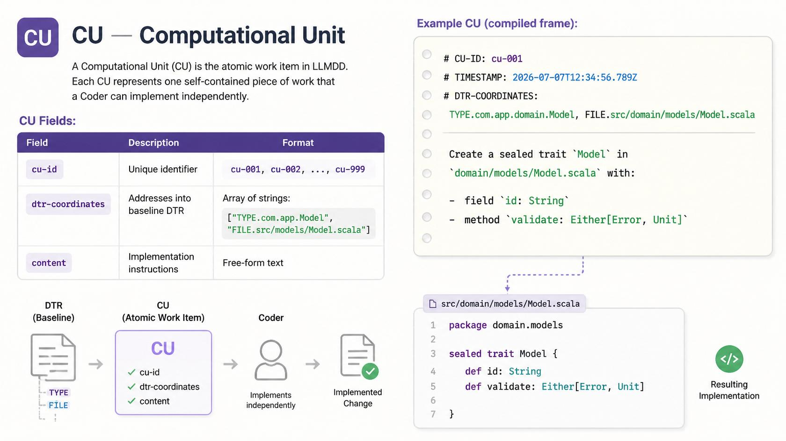
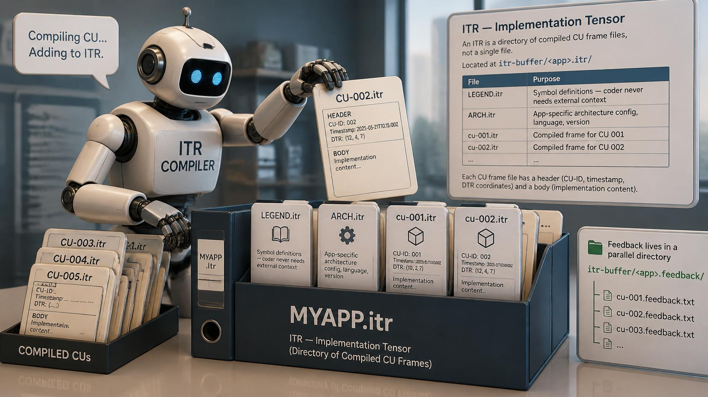
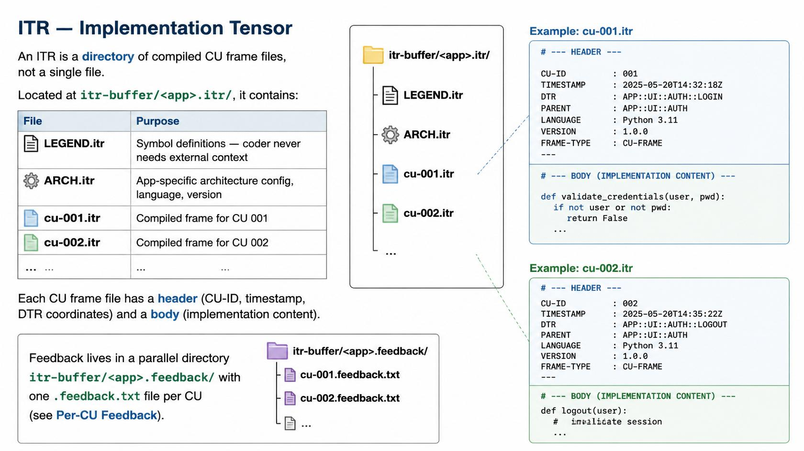

# LLM-Driven Design (LLMDD)

**LLMDD** is a structured, tensor-based workflow for AI-assisted software
development. Every design decision, architecture constraint, and
implementation step is encoded in flat `KEY=VALUE` tensor files — no nested
JSON, no YAML ambiguity, no hidden context.

---

## Table of Contents

1. [What is LLMDD?](#what-is-llmdd)
2. [The Triad](#the-triad)
3. [Pipeline Overview](#pipeline-overview)
4. [Key Concepts](#key-concepts)
   - [DTR — Design Tensor Representation](#dtr--design-tensor-representation)
   - [CU — Computational Unit](#cu--computational-unit)
   - [ITR — Implementation Tensor](#itr--implementation-tensor)
5. [CU Content Formats](#cu-content-formats)
   - [Single CU](#single-cu)
   - [JSON Batch](#json-batch)
   - [JSONL Batch](#jsonl-batch)
   - [YAML Batch](#yaml-batch)
6. [Generating a Baseline DTR](#generating-a-baseline-dtr)
   - [Extract from Existing Code](#extract-from-existing-code)
   - [Create Baseline for Greenfield](#create-baseline-for-greenfield)
7. [Compiling CUs into an ITR](#compiling-cus-into-an-itr)
8. [Architecture Constraints](#architecture-constraints)
9. [Per-CU Feedback](#per-cu-feedback)
10. [Project Structure](#project-structure)
11. [Getting Started](#getting-started)

---

## What is LLMDD?

LLMDD models every development task as a **triad of roles**, not a single
agent. A human **Designer** works with an AI **Advisor** to produce a
structured **Implementation Tensor (ITR)**, then an AI **Coder** executes it
deterministically. The result feeds back into the next design iteration.

The master specification lives in
[`system_tensors/llm-driven-design-sys-prompt.itr`](system_tensors/llm-driven-design-sys-prompt.itr).
That file is the source of truth for all agents — any chat assistant or
agent that reads this file at session start understands the LLMDD standard.

---

## The Triad

| Role     | Node | Who      | Responsibility |
|----------|------|----------|----------------|
| Designer | DSG  | Human    | Obtains baseline DTR, brainstorms, crafts CU content, runs compiler, gives green light |
| Advisor  | ADV  | AI agent | Analyzes baseline DTR, decomposes work into CUs, drafts CU content. Never writes code. |
| Coder    | COD  | AI agent | Receives compiled CU frames, implements in order, writes per-CU feedback. Never changes design. |

```
┌──────────┐   DTR    ┌──────────┐  CU content  ┌──────────────┐   frames   ┌──────────┐
│ Designer │ ───────→ │ Advisor  │ ────────────→ │ ITR Compiler │ ─────────→ │  Coder   │
│  (human) │ ←─────── │ (AI)     │ brainstorm    │   (tool)     │            │  (AI)    │
└──────────┘ discuss  └──────────┘               └──────────────┘            └──────────┘
    │                                                                             │
    │ runs dtr-builder                                                            │ implements
    ▼                                                                             ▼
  Codebase                                                                     Codebase
```



---

## Pipeline Overview

```
X (dtr-builder) → DTR (baseline) → ADV (advisor) ↔ DSG (designer) → CU content → ITR COMPILER → ITR (frames) → COD (coder) → OUT (code + feedback) → DTR (next iteration)
```

### Step-by-step

| Step | Who     | What |
|------|---------|------|
| 1. **Obtain Baseline** | DSG runs `dtr-builder` | Produces a baseline DTR from existing code or from a seed template |
| 2. **Analyze & Decompose** | ADV ↔ DSG | Analyze the DTR, brainstorm, decompose work into CUs |
| 3. **Draft CU Content** | ADV drafts, DSG approves | Each CU has an ID, DTR coordinates, and implementation content |
| 4. **Compile ITR** | DSG runs `itr-compiler` | CU content + baseline DTR → per-CU `.itr` frame files in `<app>.itr/` |
| 5. **Implement CUs** | COD | Implements CUs in dependency order, writes per-CU feedback, commits |
| 6. **Iterate** | Cycle repeats | Updated codebase → new DTR → next design iteration |

---

## Key Concepts

### DTR — Design Tensor Representation

A **DTR** is a flat file of `KEY=VALUE` lines describing a codebase. It is
produced by the **dtr-builder** tool in two modes:

| Mode | Command | Use Case |
|------|---------|----------|
| Extract | `dtr-builder --root <path> --out <file>` | Existing codebase |
| Create Baseline | `dtr-builder --create-baseline --app <name> --lang <lang> --root <path> --out <file>` | Greenfield project |

**DTR Sections:**

| Prefix | Content | Example |
|--------|---------|---------|
| `ARCH` | Architecture constraints | `ARCH=HEX,DI,DIP,NO_CROSS_LAYER` |
| `LAYER` | Layer ordering | `LAYER.ORDER=DOMAIN,APPLICATION,INFRASTRUCTURE,CONTROL` |
| `META.` | Extraction metadata | `META.GENERATOR=dtr-builder`, `META.TIMESTAMP=...` |
| `FILE.` | Source files | `FILE.src/main/Foo.scala=SIZE:1234,MIME:text/x-scala,ENCODING:UTF-8,LANG:Scala,EXT:scala` |
| `CODEX.` | Code elements | `CODEX.src/main/Foo.scala=CLASS:Foo`, `CODEX.src/main/Foo.scala=DEF:doSomething` |
| `TYPE.` | Type definitions | `TYPE.com.app.domain.Foo=KIND:CLASS,FILE:src/main/Foo.scala` |
| `REL.` | Relations | `REL.com.app.domain.Foo->com.app.domain.Bar=USES:Foo uses Bar` |

The DTR serves as a **coordinate system** — each CU can reference specific
lines in the DTR for traceability.





---

### CU — Computational Unit

A **Computational Unit (CU)** is the atomic work item in LLMDD. Each CU
represents one self-contained piece of work that a Coder can implement
independently.

**CU Fields:**

| Field | Description | Format |
|-------|-------------|--------|
| `cu-id` | Unique identifier | `cu-001`, `cu-002`, ..., `cu-999` |
| `dtr-coordinates` | Addresses into baseline DTR | Array of strings: `["TYPE.com.app.Model", "FILE.src/models/Model.scala"]` |
| `content` | Implementation instructions | Free-form text |

**Example CU (compiled frame):**
```
# CU-ID: cu-001
# TIMESTAMP: 2026-07-07T12:34:56.789Z
# DTR-COORDINATES: TYPE.com.app.domain.Model, FILE.src/domain/models/Model.scala

Create a sealed trait `Model` in `domain/models/Model.scala` with:
- field `id: String`
- method `validate: Either[Error, Unit]`
```







---

### ITR — Implementation Tensor

An **ITR** is a **directory** of compiled CU frame files, not a single file.
Located at `itr-buffer/<app>.itr/`, it contains:

| File | Purpose |
|------|--------|
| `LEGEND.itr` | Symbol definitions — coder never needs external context |
| `ARCH.itr` | App-specific architecture config, language, version |
| `cu-001.itr` | Compiled frame for CU 001 |
| `cu-002.itr` | Compiled frame for CU 002 |
| `...` | ... |

Each CU frame file has a header (CU-ID, timestamp, DTR coordinates) and a
body (implementation content).

**Feedback** lives in a parallel directory `itr-buffer/<app>.feedback/` with
one `.feedback.txt` file per CU (see [Per-CU Feedback](#per-cu-feedback)).





---

## CU Content Formats

CU content can be provided in four formats. Use single mode for one-off
compilations and batch modes (JSON, JSONL, YAML) for multi-CU work.

### Single CU

```bash
itr-compiler --compile \
  --dtr baseline.dtr \
  --out-folder itr-buffer/my-app.itr/ \
  --raw-content "Create class Foo with method bar" \
  --cu-id cu-001 \
  --dtr-coordinates "TYPE.com.app.Foo,FILE.src/Foo.scala"
```

### JSON Batch

```bash
itr-compiler --compile \
  --dtr baseline.dtr \
  --out-folder itr-buffer/my-app.itr/ \
  --json-content cus.json
```

**`cus.json`** — an array of CU objects:
```json
[
  {
    "cu-id": "cu-001",
    "dtr-coordinates": ["TYPE.com.app.domain.Model", "FILE.src/domain/models/Model.scala"],
    "content": "Create sealed trait Model in domain/models/Model.scala..."
  },
  {
    "cu-id": "cu-002",
    "dtr-coordinates": ["TYPE.com.app.application.ports.Port"],
    "content": "Create Port trait in application/ports/Port.scala..."
  }
]
```

### JSONL Batch

```bash
itr-compiler --compile \
  --dtr baseline.dtr \
  --out-folder itr-buffer/my-app.itr/ \
  --jsonl-content cus.jsonl
```

**`cus.jsonl`** — one JSON object per line:
```jsonl
{"cu-id":"cu-001","dtr-coordinates":["TYPE.com.app.domain.Model"],"content":"Create sealed trait Model..."}
{"cu-id":"cu-002","dtr-coordinates":["TYPE.com.app.application.ports.Port"],"content":"Create Port trait..."}
```

### YAML Batch

```bash
itr-compiler --compile \
  --dtr baseline.dtr \
  --out-folder itr-buffer/my-app.itr/ \
  --yaml-content cus.yaml
```

**`cus.yaml`** — keyed by CU-ID:
```yaml
cu-001:
  dtr-coordinates:
    - "TYPE.com.app.domain.Model"
    - "FILE.src/domain/models/Model.scala"
  content: "Create sealed trait Model in domain/models/Model.scala..."

cu-002:
  dtr-coordinates:
    - "TYPE.com.app.application.ports.Port"
  content: "Create Port trait in application/ports/Port.scala..."
```

---

## Generating a Baseline DTR

### Extract from Existing Code

```bash
dtr-builder --root /path/to/project --out baseline.dtr
```

This walks the source tree, scans files, extracts signatures (using AST
parsers for Scala, Java, Python, JS, TS — regex fallback for others),
detects relations, and produces a flat DTR file.

Supports filtering:
```bash
dtr-builder --root . --out baseline.dtr --filter "test/" --filter "build/"
```

### Create Baseline for Greenfield

```bash
dtr-builder --create-baseline --app my-app --lang Scala --root /path/to/project --out baseline.dtr
```

Generates a skeleton DTR with hexagonal architecture placeholders
(domain, application, infrastructure, control layers) and placeholder
FILE, CODEX, TYPE, and REL entries.

---

## Compiling CUs into an ITR

Once you have:
1. A **baseline DTR** (from extraction or creation)
2. **CU content** (in JSON, YAML, JSONL, or raw format)

Run the compiler:

```bash
itr-compiler --compile \
  --dtr baseline.dtr \
  --out-folder itr-buffer/my-app.itr/ \
  --json-content cus.json
```

**Flags:**

| Flag | Description |
|------|-------------|
| `--compile` | Invoke compile mode |
| `--dtr <path>` | Path to baseline DTR file |
| `--out-folder <path>` | Output directory for compiled frames |
| `--raw-content <text>` | Single CU content |
| `--cu-id <id>` | CU ID for raw content mode |
| `--dtr-coordinates <c1,c2>` | DTR coordinates for raw mode |
| `--json-content <path>` | JSON batch file |
| `--jsonl-content <path>` | JSONL batch file |
| `--yaml-content <path>` | YAML batch file |
| `--force` | Overwrite existing frames (default: skip) |

**Output structure:**
```
itr-buffer/my-app.itr/
├── LEGEND.itr
├── ARCH.itr
├── cu-001.itr
├── cu-002.itr
├── cu-003.itr
└── ...
```

Each `cu-<id>.itr` file contains:
```
# CU-ID: <id>
# TIMESTAMP: <iso-timestamp>
# DTR-COORDINATES: <addr1>, <addr2>

<free-form content>
```

---

## Architecture Constraints

Every LLMDD application follows these architecture rules (defined in the
system tensor under `ARCH.*`):

| Constraint | Description |
|------------|-------------|
| **HEX** | Hexagonal architecture — domain innermost, application defines ports, infrastructure provides adapters |
| **DI** | Dependency injection — all dependencies provided from outside, no service locators |
| **DIP** | Dependency inversion — high-level modules own the interfaces, low-level modules implement them |
| **NO_CROSS_LAYER** | Each layer depends only on the layer directly below it |
| **PORT_FLOW_OUT_IN** | Outbound ports defined in application layer, inbound adapters in infrastructure |
| **DOTENV_WALKUP** | DotEnv walk-up discovery is mandatory — walk from root to filesystem root, first `.env` wins |
| **SEVERITY** | CRITICAL / MAJOR / MINOR / TRIVIAL taxonomy for implementation fidelity |
| **HARD_FAIL** | Stop and report on any CRITICAL or unacknowledged MAJOR violation |

**Layer order:** `DOMAIN → APPLICATION → INFRASTRUCTURE → CONTROL`

- **DOMAIN**: Models only — entities, value objects. No logic, no infrastructure imports.
- **APPLICATION**: Services, ports, use cases — operational logic, business rules, port interfaces.
- **INFRASTRUCTURE**: Adapters, Environment singleton, DotEnv loading, IO, persistence, external APIs.
- **CONTROL**: DI container, controllers, CLI parser, entry point.

---

## Per-CU Feedback

After implementing a CU, the Coder writes a **per-CU feedback file**. This
allows distributed coders to provide feedback in parallel without conflicts.

**File pattern:** `itr-buffer/<app>.feedback/cu-<id>.feedback.txt`

**Example `cu-001.feedback.txt`:**
```ini
CU_ID=cu-001
CODER_NAME=Coder (big-pickle)
DATE=2026-07-07
CLARITY_RATING=4
AMBIGUOUS_LINES=cu-001:5-8 (dependency unclear)
MISSING_CONTEXT=NONE
TOO_MUCH_DETAIL=0
ARCHITECTURE_DEVIATION=NONE
ARCHITECTURE_DEVIATION.SEVERITY=NONE
TIME_TAKEN_MINUTES=12
AI_CREDITS_USED=2450
COMMIT_MESSAGE=feat(domain): implement Model sealed trait with validation
```

**Rules:**
- The Coder **overwrites** the file on completion (never appends)
- Git history preserves every version
- Self-assess SEVERITY for each architecture deviation
- CRITICAL deviations must be reported to DSG before commit
- The COMMIT_MESSAGE from the feedback is used as the git commit message
- One commit per **coder task** regardless of CU count

---

## Project Structure

```
llm-driven-design/
├── system_tensors/
│   └── llm-driven-design-sys-prompt.itr   # Master system prompt (source of truth)
├── dtr-builder/                            # Tool: baseline DTR generation
│   ├── bin/
│   ├── build.sbt
│   ├── dtr-builder                         # Executable script
│   └── src/
├── itr-compiler/                           # Tool: compiles CU content into ITR frames
│   ├── build.sbt
│   ├── itr-compiler                        # Executable script
│   └── src/
├── commit-tool/                            # Tool: structured git commits
│   ├── build.sbt
│   └── src/
├── itr-buffer/                             # Compiled ITR + feedback directories per app
│   ├── <app>.itr/                          # ITR frames (e.g. itr-compiler.itr/)
│   │   ├── LEGEND.itr
│   │   ├── ARCH.itr
│   │   ├── cu-001.itr
│   │   ├── cu-002.itr
│   │   └── ...
│   └── <app>.feedback/                    # Per-CU feedback (parallel to .itr/)
│       ├── cu-001.feedback.txt
│       ├── cu-002.feedback.txt
│       └── ...
├── .opencode/                              # OpenCode agent config (optional)
│   ├── agents/advisor.md
│   ├── agents/coder.md
│   └── instructions/
└── README.md

---

## Getting Started

### Prerequisites

- **Scala 2.13+** and **SBT 1.x** (for dtr-builder, itr-compiler, commit-tool)
- **Java 11+** (for running the tools)
- **(Optional)** OpenCode for agent-based sessions

### Quick Start: Greenfield Project

```bash
# 1. Generate a baseline DTR for a new app
dtr-builder --create-baseline --app my-app --lang Scala --root ./my-app --out baseline.dtr

# 2. Draft CU content (cus.json) — work with an Advisor to decompose
#    the design into Computational Units

# 3. Compile CUs into ITR frames
itr-compiler --compile --dtr baseline.dtr --out-folder itr-buffer/my-app.itr/ --json-content cus.json

# 4. Implement CUs (Coder session)
#    The Coder reads the compiled frames from itr-buffer/my-app.itr/
#    and implements them in dependency order

# 5. After implementation, re-scan to produce next-iteration DTR
dtr-builder --root ./my-app --out baseline.dtr
```

### Quick Start: Existing Codebase

```bash
# 1. Extract baseline DTR from existing code
dtr-builder --root ./existing-project --out baseline.dtr

# 2. Continue with the same workflow as greenfield
#    (draft CU content → compile → implement → iterate)
```

### Agent Sessions (with OpenCode)

```bash
# Start an Advisor session for design work
opencode --agent advisor

# Start a Coder session for implementation
opencode --agent coder
```

---

## License

This project is licensed under the [Creative Commons Attribution-NonCommercial-ShareAlike 4.0 International Public License](LICENSE).

See [LICENSE](LICENSE).
